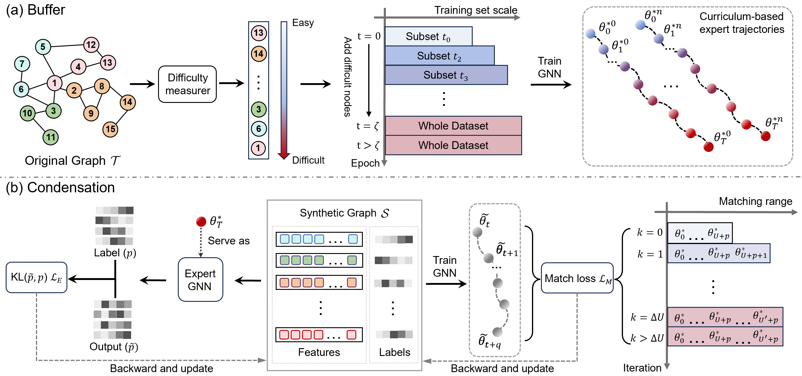

# GEOM
Pytorch implementation of "Navigating Complexity: Toward Lossless Graph Condensation via Expanding Window Matching".

The overall framework of the proposed GEOM:



Experimental Results:

## Requirements
Please see [requirements](/requirements).
```bibtex
pip install -r requirements.txt
```


## Acknowledgement
Our code is built upon [SFGC](https://github.com/Amanda-Zheng/SFGC) and [CLNode](https://github.com/wxwmd/CLNode).

## Citation
Welcome to discuss with [yuchenzhang@std.uestc.edu.cn](mailto:yuchenzhang@std.uestc.edu.cn). If you find this repo to be useful, please cite our paper. 

```bibtex
@inproceedings{
}
```
